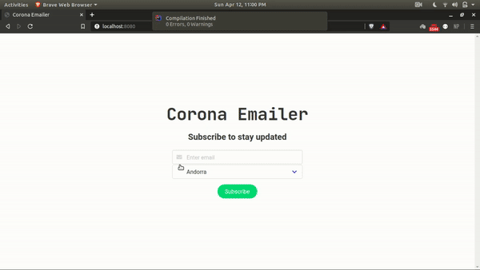

# Corona-Emailer



**Tech Stack**

* **Spring Boot**
	- Java Mail API (For sending email)
	- HtmlUnit (headless web browser for java)
	- Jsoup (for scraping)
* **Web Page**
	- Thymeleaf (templating)
	- Bulma (css)


## How to run 

* #### Clone the repo

`https://github.com/YoursSohail/CoronaEmailer.git`


* #### Create 'src/main/resources/application.properties' file

Enter the following lines.
```
spring.datasource.url=jdbc:postgresql://localhost/YOUR_DATABASE_NAME
spring.datasource.username=USERNAME
spring.datasource.password=PASSWORD
spring.jpa.generate-ddl=true
com.yourssohail.emailFrom=EMAILID
com.yourssohail.password=PASSWORD
```    
* #### Build & Run

  
